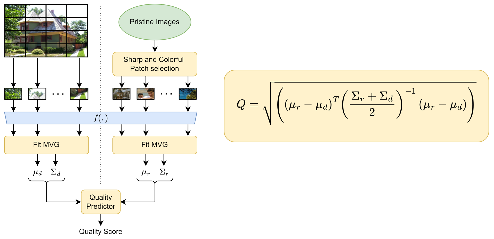

# Batch NIQE
A modular code for computing the NIQE distance on batches of features using PyTorch.



## Usage
```
## The features 'p' from the set of pristine patches are used to estimate the Gaussian parameters in the NIQE model
niqe_model = NIQE(p).cuda()
## The input image patch features 'x' are fed into the NIQE model to compute the final scores.
score = niqe_model(x)
```
